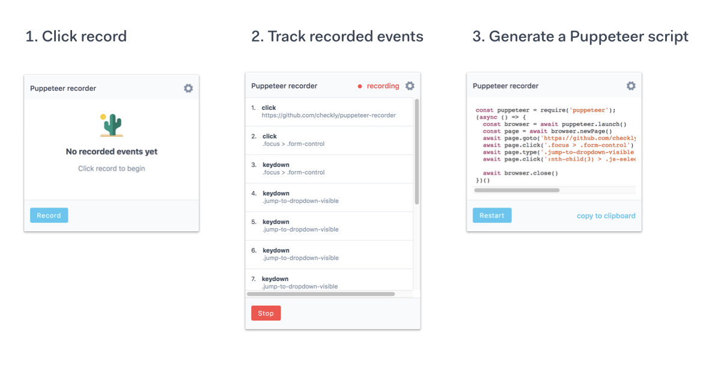

# Headless Recorder (previously Puppeteer Recorder)

[](https://travis-ci.org/checkly/headless-recorder)

#### Gold sponsor
[](https://checklyhq.com?utm_source=github&utm_medium=sponsor-logo-github&utm_campaign=headless-recorder)



⭐️ Puppeteer Recorder is now **Headless Recorder** and supports Playwright! ⭐️   

Headless recorder is a Chrome extension that records your browser interactions and generates a
[Puppeteer](http://pptr.dev/) or [Playwright](https://playwright.dev/) script. Install it from the [Chrome Webstore](https://chrome.google.com/webstore/detail/puppeteer-recorder/djeegiggegleadkkbgopoonhjimgehda).
Don't forget to check out our sister project [theheadless.dev](https://theheadless.dev/), the open source knowledge base for Puppeteer and Playwright.

This project does the following already:

- Records clicks and type events.
- Add waitForNavigation, setViewPort and other useful clauses.
- Generates a Puppeteer script.
- Shows which events are being recorded.
- Copy to clipboard.
- Offers configuration options.
- Allows data-id configuration for element selection.

> Note: we only record certain events. See `dom-events-to-record.js` in the code-generator folder for which events. This collection will be expanded in future releases.

## Usage

- Click the icon and hit Record.
- Hit <kbd>tab</kbd> after you finish typing in an `input` element.
- Click links, inputs and other elements.
- Wait for full page load on each navigation. The icon will switch from  to .
- Click Pause when you want to navigate without recording anything. Hit Resume to continue recording.

## Background

Writing Puppeteer or Playwright scripts for scraping, testing and monitoring can be tricky. A recorder / code generator can be helpful,
even if the code isn't perfect. This project builds on other projects (see [disclaimer](#user-content-credits--disclaimer)
below) but adds extensibility, configurability and a smoother UI.

## Development

1. Run: `git clone https://github.com/checkly/headless-recorder.git`
2. Build the project: `cd headless-recorder && npm i && npm run dev`
2. Navigate to chrome://extensions
3. Make sure 'Developer mode' is checked
4. Click Load unpacked extension...
5. Browse to headless-recorder/build and click Select

## Cutting a Release

- bump versions in `package.json` and `manifest.json`
- tag the code with the version, i.e. `git tag v0.4.0`
- push with tags `git push --tags`

Now generate a release with **gren**. Make sure all issues associated with the new version are linked to a milestone
with the name of the tag.

```
gren release --override --data-source=milestones --milestone-match="{{tag_name}}"
```

## Credits & disclaimer

Headless recorder is the spiritual successor & love child of segment.io's
[Daydream](https://github.com/segmentio/daydream) and [ui recorder](https://github.com/yguan/ui-recorder).
Headless Recorder was previously named "Puppeteer Recorder".

## License
Apache 2
