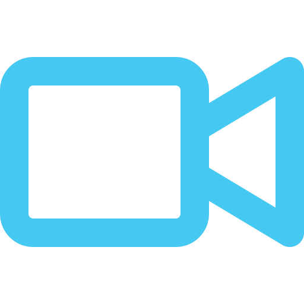
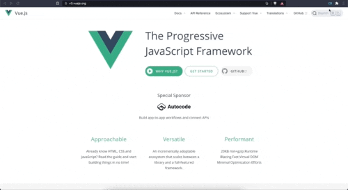
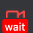
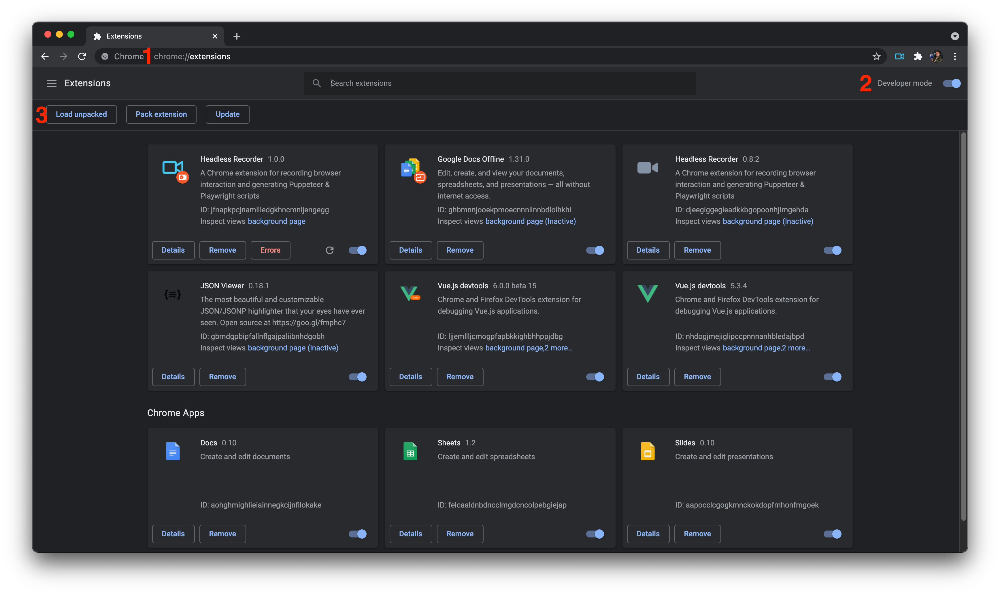

<p align="center">
  
</p>

<p>
  
  <h1>Headless Recorder</h1>
</p>

<p>
  
  
  
</p>


> 🎥 Headless recorder is a Chrome extension that records your browser interactions and generates a Playwright/Puppeteer script.


<br>
<p align="center">
  
</p>
<br>

## 👀 Overview

Headless recorder is a Chrome extension that records your browser interactions and generates a [Playwright](https://playwright.dev/) or [Puppeteer](http://pptr.dev/)script. Install it from the [Chrome Webstore](https://chrome.google.com/webstore/detail/puppeteer-recorder/djeegiggegleadkkbgopoonhjimgehda) to get started!

This project builds on existing open source projects (see [Credits](#-credits)) but adds extensibility, configurability and a smoother UI. For more information, please check our [documentation](https://www.checklyhq.com/docs/headless-recorder/).

> 🤔 Do you want to learn more about Puppeteer and Playwright? Check our open [Headless Guides](https://www.checklyhq.com/learn/headless/)

<br>

## 🏗️ What you can do?

- Records clicks and type events.
- Add waitForNavigation, setViewPort and other useful clauses.
- Generates a Playwright & Puppeteer script.
- Preview CSS selectors of HTML elements.
- Take full page and element screenshots.
- Pause, resume and restart recording.
- Persist latest script in your browser
- Copy to clipboard.
- Run generated scripts directly on [Checkly](https://checklyhq.com)
- Flexible configuration options and dark mode support.
- Allows `data-id` configuration for element selection.

#### Recorded Events
  - `click`
  - `dblclick`
  - `change`
  - `keydown`
  - `select`
  - `submit`
  - `load`
  - `unload`

> This collection will be expanded in future releases. 💪

<br>

## 🔧 How to use?

1. Click the icon and hit the red button.
2. 👉 Hit <kbd>tab</kbd> after you finish typing in an `input` element. 👈
3. Click on links, inputs and other elements.
4. Wait for full page load on each navigation.

    **The icon will switch from 
    to  to indicate it is ready for more input from you.**

5. Click Pause when you want to navigate without recording anything. Hit Resume to continue recording.

<br>

## 🖥️ Run Locally

After cloning the project, open the terminal and navigate to project root directory.

```bash
$ npm i # install dependencies

$ npm run serve # run development mode

$ npm run test # run test cases

$ npm run lint # run and fix linter issues

$ npm run build # build and zip for production
```

<br>

## 🧩 Install Locally

1. Open chrome and navigate to extensions page using this URL: [`chrome://extensions`](chrome://extensions).
1. Make sure "**Developer mode**" is enabled.
1. Click "**Load unpacked extension**" button, browse the `headless-recorder/dist` directory and select it.



<br>

## 🚀 Release

1. Bump version using `npm version` (patch, minor, major).
2. Push changes with tags `git push --tags`
3. Generate a release using **gren**: `gren release --override --data-source=milestones --milestone-match="{{tag_name}}"`

> 🚨 Make sure all issues associated with the new version are linked to a milestone with the name of the tag.

<br>

## 🙏 Credits

Headless recorder is the spiritual successor & love child of segment.io's [Daydream](https://github.com/segmentio/daydream) and [ui recorder](https://github.com/yguan/ui-recorder).

<br>

## 📄 License

[MIT](https://github.com/checkly/headless-recorder/blob/master/LICENSE)


<p align="center">
  <a href="https://checklyhq.com?utm_source=github&utm_medium=sponsor-logo-github&utm_campaign=headless-recorder" target="_blank">
  
  </a>
  <br />
  <i><sub>Delightful Active Monitoring for Developers</sub></i>
  <br>
  <b><sub>From Checkly with ♥️</sub></b>
<p>

